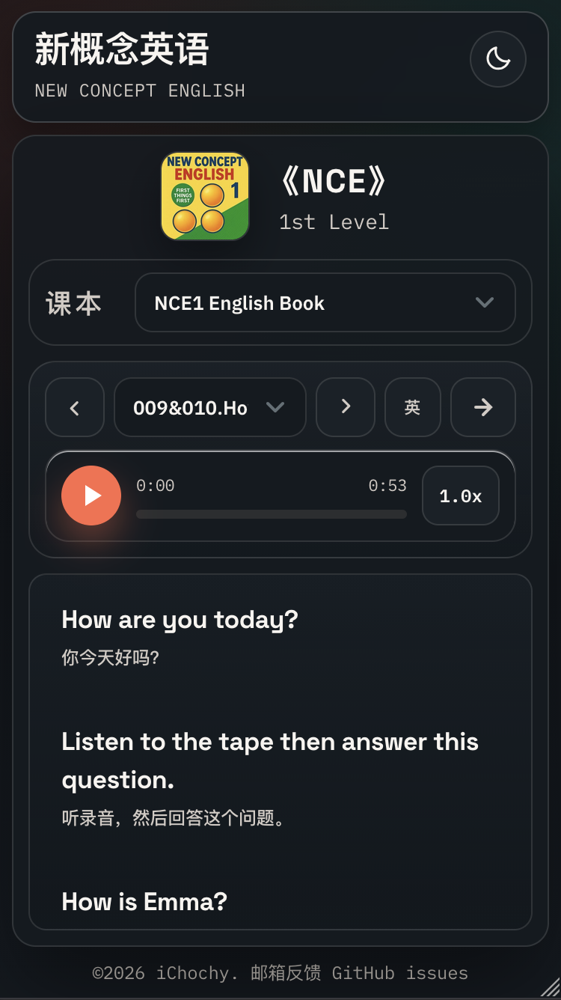
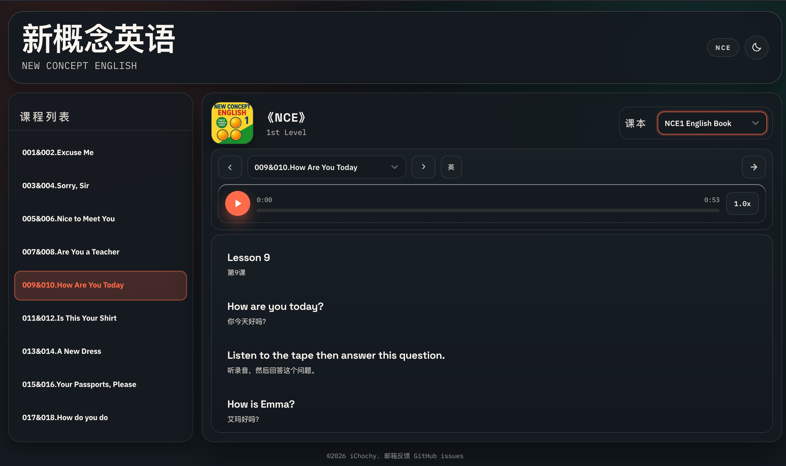

# iReader · 英语在线点读系统

一个**资源与播放系统分离**的英语在线点读系统。播放器只负责「读、播、记」，学习资源以静态文件的形式外挂接入——任何人都可以为自己制作专属教材资源。

- 🌐 在线体验：[https://tap.ichochy.com](https://tap.ichochy.com)
- 📖 默认资源：《译林英语》4A / 4B / 5A / 5B / 6A
- 📚 资源仓库参考：[QiLoong/YL-English-Book](https://github.com/QiLoong/YL-English-Book)

## ✨ 功能特性

| 功能 | 说明 |
| --- | --- |
| 单句点读 | 点击任意句子，立即从该句开始朗读 |
| 点句点读 | 点读模式下，播完当前句自动停止 |
| 单句循环 | 反复朗读当前句，适合跟读模仿 |
| 全文朗读 | 播放 / 暂停一键控制，支持列表循环 |
| 速度调节 | 0.5x – 2.0x 六档倍速切换 |
| 双语展示 | 双语 / 仅英文 / 仅中文 / 模糊翻译四种模式 |
| 课文切换 | 上一课 / 下一课快速切换 |
| 进度记录 | 自动记住课本、单元、播放进度与显示偏好 |
| 外挂资源 | 任意静态资源目录均可接入，无需改动播放器 |
| 明暗主题 | 跟随系统偏好，也可手动切换 |
| 智能预加载 | 预加载下一课音频与歌词，切换零等待 |

## 🚀 在线使用

打开 [https://tap.ichochy.com](https://tap.ichochy.com) 即可开始学习，默认内置《译林英语》4A–6A 五个学期课本，可在页面上方下拉切换。

通过 URL Hash 直达指定课本（可分享给同学）：

```
https://tap.ichochy.com/#YL4A   # 译林英语 4A
https://tap.ichochy.com/#YL5A   # 译林英语 5A（默认）
https://tap.ichochy.com/#YL6A   # 译林英语 6A
```

## 📦 外挂资源

系统的核心设计：**播放器与资源完全解耦**。一份学习资源就是一个可静态托管的目录，包含 `book.json` 描述文件、每课的 MP3 音频与 LRC 歌词。

### 目录结构

```
your-book/
├── book.json          # 课本描述文件（必需）
├── cover.png          # 课本封面（可选）
├── unit1.mp3          # 课文音频
├── unit1.lrc          # 课文歌词（中英对照）
├── unit2.mp3
└── unit2.lrc
```

### book.json

```json
{
  "bookCover": "cover.png",
  "units": [
    { "title": "Unit 1 Hello", "filename": "unit1" },
    { "title": "Unit 2 Nice to meet you", "filename": "unit2" }
  ]
}
```

系统按 `${bookPath}/${filename}.mp3` 与 `${bookPath}/${filename}.lrc` 拼接资源地址。

### LRC 歌词格式

标准 LRC 时间标签，`|` 分隔英文与中文：

```
[00:12.34]Good morning, class. | 早上好，同学们。
[00:15.00]Stand up, please. | 请起立。
[00:18.50]Sit down, please. | 请坐。
```

- 时间标签支持 `[mm:ss.xx]` 或 `[mm:ss.xxx]`
- `|` 左侧为英文、右侧为中文（中文可省略）
- `#` 开头的行视为注释，空行自动忽略

### 接入自己的资源

1. **准备资源**：按上述结构生成 `book.json`、MP3 与 LRC 文件，托管到任意支持 CORS 的静态服务器（GitHub Pages、Vercel、OSS、Nginx 等）
2. **注册课本**：在 `data.json` 的 `books` 数组中添加一条记录：

   ```json
   {
     "key": "MYBOOK",
     "title": "My English Book",
     "bookPath": "https://your-domain.com/your-book"
   }
   ```

3. **访问**：部署播放器后，通过 `https://your-player.com/#MYBOOK` 直达该课本

> ⚠️ 资源服务器需返回 CORS 头（如 `Access-Control-Allow-Origin: *`），否则浏览器会拦截跨域请求 `book.json` 与 LRC 文件。

## 🖥️ 本地部署

项目为纯静态站点，无构建步骤，任意静态服务器均可直接运行。

### 方式一：Nginx（macOS 示例）

```bash
# 1. 下载并解压项目到用户目录
#    https://github.com/iChochy/iReader/archive/refs/heads/main.zip

# 2. 安装 Nginx
brew install nginx

# 3. 修改配置 /opt/homebrew/etc/nginx/nginx.conf
#    server {
#        listen       80;
#        server_name  localhost;
#        location / {
#            root   /Users/iChochy/iReader;
#            index  index.html index.htm;
#        }
#    }

# 4. 启动
brew services start nginx
```

访问 [http://localhost](http://localhost) 即可。

### 方式二：其他静态服务器

```bash
# Python
python3 -m http.server 8080

# Node.js
npx serve .
```

### 方式三：GitHub Pages

将项目推送到仓库，在 Settings → Pages 中开启部署，即可获得 `https://<user>.github.io/iReader` 的在线地址。

## 🧩 项目结构

```
iReader/
├── index.html              # 页面入口（含 SEO 与结构化数据）
├── data.json               # 课本注册表（外挂资源挂载点）
├── css/
│   └── style.css           # 样式（明暗主题）
├── js/
│   ├── main.js             # 应用入口
│   ├── config.js           # 全局配置与状态模板
│   ├── ReadingSystem.js    # 核心阅读系统（课本/单元/歌词/播放）
│   ├── LRCParser.js        # LRC 歌词解析器
│   ├── managers/           # 缓存 / 事件 / 预加载管理器
│   ├── ui/                 # 主题切换 / 打赏弹窗
│   └── utils/              # DOM / 存储 / 工具函数
├── screenshot/             # 界面截图
├── favicon.png
└── LICENSE
```

## 🛠️ 技术栈

- 原生 HTML / CSS / JavaScript（ES Modules）
- 零框架、零依赖、零构建，打开即用
- HTML5 Audio API 播放
- localStorage 持久化学习进度

## 💾 数据存储

学习进度保存在浏览器 localStorage 中，刷新或再次访问自动恢复：

| 存储键 | 内容 |
| --- | --- |
| `selectedBookKey` | 最近使用的课本 |
| `{bookPath}/currentUnitIndex` | 当前单元 |
| `{bookPath}/{unitIndex}/playTime` | 单元播放进度（秒） |
| `playbackRate` | 播放速度 |
| `loopMode` | 循环模式（off / click / sentence / list） |
| `translationMode` | 翻译模式（show / english / chinese / blur） |
| `theme` | 明暗主题 |

## 📸 系统截图

**Mobile**



**PC**



## 📄 开源许可

[MIT](LICENSE) © 2025 iChochy

## 🙏 支持与反馈

- 问题反馈 / 功能建议：[GitHub Issues](https://github.com/iChochy/iReader/issues)
- 作者博客：[ichochy.com](https://ichochy.com)
- 如果这个项目对你有帮助，欢迎在页面中点击「打赏支持」☕


## ☕ 打赏

请帮忙点赞、收藏和转发


如果内容帮到过您，求打赏一点生命值(可选)  
80后码农×白血病(CMML)  
工作已停，药费没停  
感谢您的善意，谢谢！！！